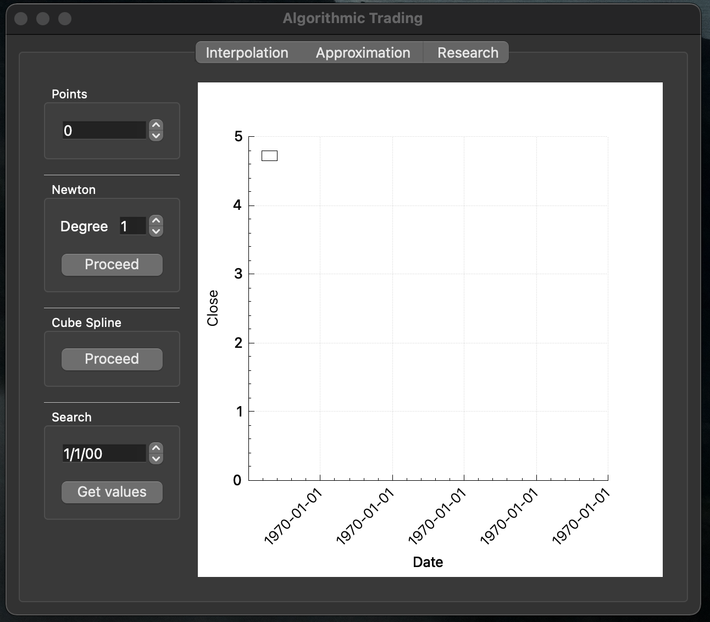

# Algorithmic trading

Implementation of the Algorithmic trading project.


## Contents

1. [Chapter I](#chapter-i) \
    1.1. [Building](#building)
2. [Chapter II](#chapter-ii) \
    2.1. [Start](#start)  
    2.2. [Interpolation](#interpolation)  
    2.3. [Approximation](#approximation)  
    2.4. [Research](#research)  


## Chapter I  

## Building


To builld project `make` and `cmake` must be installed. 

Go to project_directory/src in terminal and run `make`. It will start building the project in the build directory using cmake. After that, the program will automatically start.




If you see the output above - everything is correct and the program works just fine.

## Chapter II

## Start

To get started, open the `File` tab and click `Open`. Select a file for data analysis. The file format must be `.csv`. It must contain the following data:
 - Date (format: `yyyy-MM-dd`, required)
 - Close (format: `double`, required)
 - Weight (format: `double`, optional)

Example of .csv file:

```
Date,Close
2021-03-22,123
2021-03-23,122.540001
...
```
```
Date,Close,Weight
2021-03-22,12.850000,1
2021-03-23,12.210000,2.5
2021-03-24,12.140000,
...
```

When uploading another file, the data will be replaced.
In case of any error, an error message box will appear.


### Interpolation

*Interpolation* is a method of finding intermediate values of a quantity based on a discrete set of known values.

Two interpolations metods are implimented: `Newton interpolation polynomial` (with the possibility of choosing the degree of the polynomial) and `Cubic spline interpolation`.

You can choose how many points your graph will contain (but not less than the number of data points).
There can be 5 graphs on the screen at the same time. To clear graphs, open the `Plot` tab and click `Clear`.

You can also search for a value on a specific date in the `Search` area. The date must be within the uploaded points' dates.


### Approximation

*Approximation* is a replacement of some mathematical objects by others, in one sense or another, close to the original ones.

Least Squares Method was implimented: (with the possibility of choosing the degree of the polynomial).

You can choose how many points your graph will contain (but not less than the number of data points). You can also choose how long to extend the graph (in days). When changing the length of days, the Plot area is automatically cleared and a new graph is drawn.
There can be 5 graphs on the screen at the same time. To clear graphs, open the `Plot` tab and click `Clear`.

You can also search for a value on a specific date in the `Search` area.

When the weighted dataset is loaded, you can proceed "Research". The following chart will be generated:
    - With the degree of polynomial 1 for a table with user-defined weights
    - With the degree of polynomial 2 for a table with user-defined weights
    - With the degree of polynomial 1 for a table in which all weights are 1
    - With the degree of polynomial 2 for a table in which all weights are 1


## Research
Study the temporal characteristics of interpolations by `cubic spline` and `Newton polynomial` methods, depending on the number of calculated points.

You set the maximum number of points `k` and the number of partitions `h`. The minimum number `k` is the number of entries in the input table.
The measurements are repeated "h" times, each performed 10 times, and the arithmetic mean will be calculated.

Graphs are built after measurements.

This part of the program is not in a separate thread, so be wise with the choice of number of points and parts.


